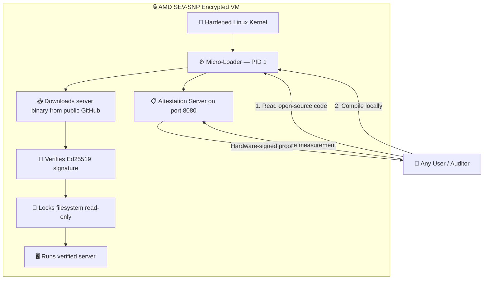
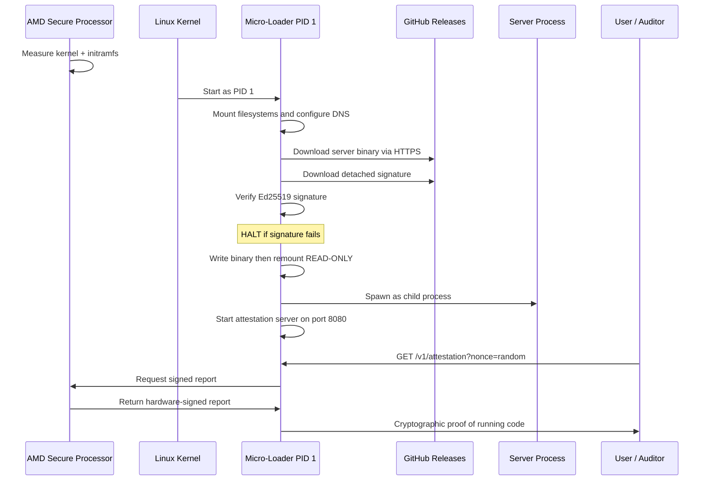

# Confidential Micro-Loader

### A Zero-Trust Bootloader for AMD SEV-SNP Confidential Virtual Machines

---

## What Problem Does This Solve?

When you use a cloud server (AWS, Azure, Google Cloud, etc.), you are trusting the cloud provider with **everything**: your data, your code, and your encryption keys. The provider's employees, their hypervisor software, and even their hardware could theoretically spy on or modify your workload.

**This project eliminates that trust requirement entirely.**

Using AMD's [SEV-SNP](https://www.amd.com/en/developer/sev.html) hardware technology, this bootloader creates a **cryptographically sealed environment** where:

- ☑️ **Nobody** can see inside the virtual machine — not the cloud provider, not their employees
- ☑️ **Nobody** can modify the code running inside — not even the person who deployed it
- ☑️ **Anyone** can mathematically prove exactly what code is running
- ☑️ **Everything** is open source — the bootloader, the kernel, the build process

> **In simple terms:** Imagine a locked safe that even the locksmith can't open. You can look through a window to verify what's inside, but nobody can change its contents after it's been sealed.

---

## How It Works



### Boot Sequence



---

## Table of Contents

- [Why a Micro-Loader Instead of Just the Server?](#why-a-micro-loader-instead-of-just-the-server)
- [Threat Model Summary](#threat-model-summary)
- [How to Verify (For Non-Technical Users)](#how-to-verify-for-non-technical-users)
- [Step-by-Step Build Guide](#step-by-step-build-guide)
- [Compute the SEV-SNP Measurement](#compute-the-sev-snp-measurement)
- [Local Testing with QEMU](#local-testing-with-qemu)
- [Full Documentation](#full-documentation)

---

## Why a Micro-Loader Instead of Just the Server?

The VM does **not** contain the actual server software directly. Instead, it contains a tiny, auditable "loader" that fetches the real server at boot time from a public GitHub release. This is a deliberate security design with three layers of protection:

| Layer | What It Protects Against | How |
|:---|:---|:---|
| **Source is public** | Hidden backdoors | The server is built from a public open-source repo using GitHub Actions. Anyone can read the source and compile it themselves. |
| **URL is hardcoded** | Redirection attacks | The download URL is compiled into the measured binary. The loader cannot download from anywhere else. Changing the URL changes the measurement. |
| **Signature is required** | Tampered releases | Every binary must carry a valid Ed25519 signature. The public key is hardcoded. Even if GitHub is compromised, unsigned code is rejected. |

> The loader is ~750 lines of Rust — small enough to audit completely in an afternoon.

---

## Threat Model Summary

| Threat | Attacker | Mitigation |
|:---|:---|:---|
| **Cloud provider spies on VM** | Provider | AMD SEV-SNP encrypts all VM memory with a hardware key the provider cannot access |
| **Provider modifies boot code** | Provider | AMD Secure Processor measures kernel+initramfs. Any change alters the measurement |
| **DNS hijacking** | Provider/Network | DNS resolvers hardcoded (Quad9 + Cloudflare). DHCP DNS ignored |
| **TLS interception** | Provider/State | TLS 1.3 only, AES-256-GCM only, post-quantum X25519MLKEM768 key exchange. Embedded CA store |
| **GitHub serves malicious binary** | GitHub/State | Downloaded binary requires valid Ed25519 signature. Only owner holds private key |
| **Owner pushes backdoor** | Owner | Server source is public. Attestation server exposes payload SHA-384 for independent verification |
| **Server exploit** | Attacker | Binary on READ-ONLY mount. Writable dirs are NOEXEC. No shell or SSH exists |
| **Malicious code interferes** | Any | Any anomaly (server death, attestation failure) triggers **immediate VM power-off** |
| **Kernel module injection** | Any | Kernel compiled with `CONFIG_MODULES=n`. Modules disabled at compile time |
| **Physical RAM access** | Datacenter | SEV-SNP hardware encryption. Physical access yields only ciphertext |

> 📖 Full details: [Threat Model](docs/threat_model.md) · [Loader Security Audit](docs/loader_security.md) · [Architecture](docs/architecture.md)

---

## How to Verify (For Non-Technical Users)

1. **Compile the same source code** on your computer (the build script does everything automatically)
2. **Your computer produces a measurement** — a unique fingerprint of the code
3. **Ask the live server** for its measurement — AMD hardware signs it with an unforgeable key
4. **If the numbers match**, you have mathematical proof the server runs the audited code

> No trust required. No one's word. Pure mathematics.

---

## Step-by-Step Build Guide

### Option A: Reproducible Build (Recommended)

This guarantees **byte-for-byte identical** binaries to the official release.

**Prerequisites:** [Docker](https://docs.docker.com/get-docker/) must be installed and running.

<details>
<summary><b>How to install Docker (click to expand)</b></summary>

**Ubuntu / Debian:**
```bash
sudo apt update && sudo apt install -y docker.io
sudo systemctl start docker && sudo systemctl enable docker
sudo usermod -aG docker $USER
# Log out and back in, then verify:
docker run hello-world
```

**macOS:** Install [Docker Desktop for Mac](https://docs.docker.com/desktop/install/mac-install/)

**Windows:** Install [Docker Desktop for Windows](https://docs.docker.com/desktop/install/windows-install/) with WSL2 backend

</details>

**Build:**
```bash
git clone https://github.com/deadrouter-ai/sev-micro-loader.git
cd sev-micro-loader
git checkout v1.0.0 # Replace with the release tag you want to verify
./build_reproducible.sh
```

When finished, the script prints the **Final SEV-SNP Measurement**. Compare it against the [GitHub Release page](https://github.com/deadrouter-ai/sev-micro-loader/releases).

> **Why Docker?** Different compiler versions produce different binaries. Docker ensures everyone uses the exact same compiler (Ubuntu 24.04 + GCC 11.4.0 + Rust 1.95.0).

---

### Option B: Native Build (For Developers)

> ⚠️ Native builds produce different hashes. Use for development only, not for verifying releases.

```bash
# Install dependencies (Ubuntu/Debian)
sudo apt install -y build-essential flex bison libssl-dev libelf-dev wget rpm2cpio cpio jq python3 python3-pip ccache musl-tools bc

# Install Rust
curl --proto '=https' --tlsv1.2 -sSf https://sh.rustup.rs | sh -s -- -y --default-toolchain 1.95.0
source $HOME/.cargo/env
rustup target add x86_64-unknown-linux-musl

# Build kernel
chmod +x build_kernel.sh && ./build_kernel.sh

# Build micro-loader
RUSTFLAGS="--remap-path-prefix $(pwd)=/workspace" cargo build --locked --release --target x86_64-unknown-linux-musl

# Create initramfs
mkdir -p rootfs/proc rootfs/sys rootfs/dev rootfs/tmp
cp target/x86_64-unknown-linux-musl/release/sev-micro-loader rootfs/init
find rootfs -exec touch -h -d @0 {} +
cd rootfs && find . -mindepth 1 | LC_ALL=C sort | cpio -o -H newc -R 0:0 --reproducible > ../zero_trust_os.cpio && cd ..
```

---

## Compute the SEV-SNP Measurement

```bash
# Clone measurement tool
git clone https://github.com/virtee/sev-snp-measure.git
pip3 install -r sev-snp-measure/requirements.txt --break-system-packages

# Download OVMF firmware
wget -q https://download.rockylinux.org/pub/rocky/10.1/devel/x86_64/os/Packages/e/edk2-ovmf-20250523-2.el10.noarch.rpm
rpm2cpio edk2-ovmf-20250523-2.el10.noarch.rpm | cpio -idmv

# Verify OVMF hash
echo "8082ac81116050b9d2757e99985c23672ba88d397632f6cb1487a553cf31ef5736edad37177926bbe8e9c8153c5295c0  usr/share/edk2/ovmf/OVMF.amdsev.fd" | sha384sum -c

# Compute measurement
python3 sev-snp-measure/sev-snp-measure.py \
    --mode snp --vcpus=2 --vcpu-type=EPYC-v3 \
    --ovmf=./usr/share/edk2/ovmf/OVMF.amdsev.fd \
    --kernel=./linux-6.12.91/arch/x86/boot/bzImage \
    --initrd=./zero_trust_os.cpio \
    --append="console=ttyS0 ip=dhcp"
```

Compare the output with the **Final SEV-SNP Measurement** from the [Release page](https://github.com/deadrouter-ai/sev-micro-loader/releases).

---

## Local Testing with QEMU

```bash
qemu-system-x86_64 \
    -kernel linux-6.12.91/arch/x86/boot/bzImage \
    -initrd zero_trust_os.cpio \
    -m 1024 -nographic -no-reboot \
    -append "console=ttyS0 ip=dhcp" \
    -netdev user,id=net0,hostfwd=tcp::8080-:8080 \
    -device virtio-net-pci,netdev=net0
```

Test attestation (from another terminal):
```bash
curl -s "http://localhost:8080/v1/attestation?nonce=$(openssl rand -hex 64)" | python3 -m json.tool
```

> On non-SEV hardware, the response will be `snp_unavailable`. This is normal for local testing.
> The attestation endpoint accepts any user-defined nonce from 1 to 128 bytes in hex format (2 to 256 characters).

---

## Full Documentation

| Document | Description |
|:---|:---|
| [Architecture](docs/architecture.md) | Detailed boot process and system design |
| [Threat Model](docs/threat_model.md) | Comprehensive threat analysis with mitigations |
| [Loader Security Audit](docs/loader_security.md) | Why runtime-fetching is safe — detailed analysis |
| [Reproducible Builds](docs/reproducible_builds.md) | How and why the build process is deterministic |

---

## License

This project is open source. See [LICENSE](LICENSE) for details.
