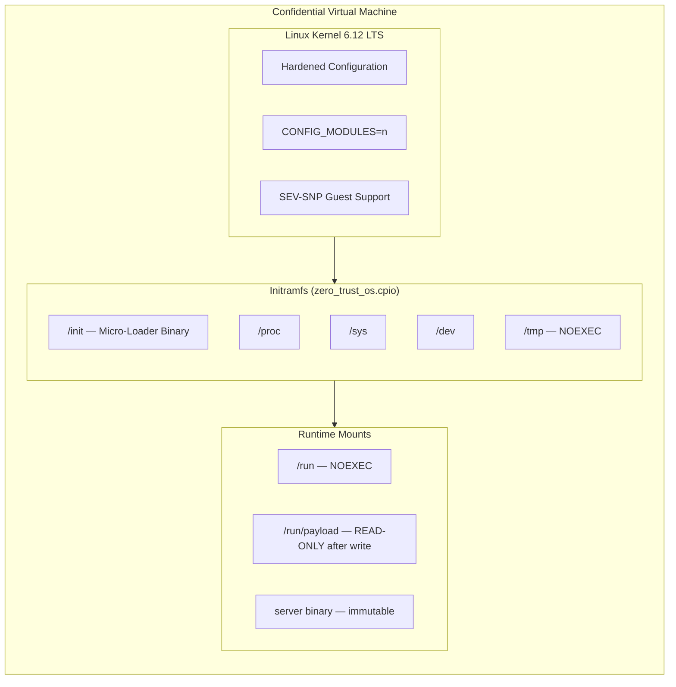

# Architecture

The Confidential Micro-Loader is a specialized `init` system (PID 1) designed to bootstrap a secure server inside an AMD SEV-SNP confidential virtual machine. There is **no traditional Linux distribution** underneath — no systemd, no bash, no SSH, no package managers. The entire system consists of two components: a hardened Linux kernel and a single static Rust binary.

## System Components



## Boot Process (Step by Step)

### Step 1: Hardware Measurement

Before the kernel even starts, the **AMD Secure Processor** (a dedicated ARM core embedded in every AMD EPYC CPU) measures the entire boot image:
- The OVMF firmware (UEFI bootloader)
- The Linux kernel (`bzImage`)
- The initramfs (`zero_trust_os.cpio`)

This measurement is stored in a tamper-proof hardware register. Any modification to any of these components — even a single byte — will produce a completely different measurement. This measurement cannot be faked or overridden by any software, including the hypervisor.

### Step 2: Bare-Metal Bootstrapping

The kernel starts the micro-loader as PID 1 directly from the initramfs. The loader:
- Mounts essential filesystems (`/proc`, `/sys`, `/dev`)
- Mounts `/tmp` with `NOEXEC` flag (nothing written there can be executed)
- Mounts `/run` with `NOEXEC` flag
- Creates `/run/payload` as a dedicated tmpfs for the server binary

### Step 3: Network & DNS Initialization

The loader manually brings up network interfaces and configures DNS:
- **Loopback** (`lo`) is configured via raw socket ioctls
- **Ethernet interfaces** are brought UP if not already
- **DNS resolvers** are hardcoded to Quad9 (`9.9.9.9`) and Cloudflare (`1.1.1.1`)

> **Critical:** DHCP-provided DNS is deliberately ignored. The cloud provider cannot redirect DNS queries to a malicious resolver.

### Step 4: Secure Payload Fetching

The loader downloads the production server binary and its detached Ed25519 signature from **hardcoded URLs** pointing to a public GitHub release:

```
https://github.com/deadrouter-ai/api-proxy-server/releases/latest/download/server
https://github.com/deadrouter-ai/api-proxy-server/releases/latest/download/server.sig
```

TLS is configured with an **embedded Mozilla CA root certificate store**. The loader does not use `/etc/ssl/certs` from the host, which could be tampered with. This makes TLS man-in-the-middle attacks impossible without breaking the TLS connection entirely.

### Step 5: Cryptographic Verification

The downloaded binary is verified against a **hardcoded Ed25519 public key**:

```
If signature is INVALID → System halts immediately. No code executes. Ever.
If signature is VALID   → Binary is accepted and its SHA-256 hash is computed.
```

This ensures that even if the download URL were somehow redirected (which is impossible because it's hardcoded), the attacker would need the owner's private signing key to produce a valid signature.

### Step 6: Filesystem Lockdown

After writing the verified binary to `/run/payload/server`:

1. `/run/payload` is **remounted as READ-ONLY** — the binary becomes immutable
2. `/tmp` is mounted with **NOEXEC** — nothing written there can execute
3. `/run` is mounted with **NOEXEC** — same

**After lockdown, no writable+executable filesystem exists anywhere in the VM.** Even if the server process is exploited via a zero-day, the attacker cannot:
- Modify the running binary (read-only)
- Drop and execute a payload anywhere (all writable locations are noexec)
- Load a kernel module (modules disabled at compile time)
- Open a shell (no shell binary exists)

### Step 7: Process Isolation

The server is spawned as a **child process** (not via `execve`). PID 1 (the loader) remains running and serves two critical roles:

1. **Independent attestation endpoint** on port 8080 — this is part of the measured code and cannot be tampered with
2. **Zombie process reaper** — required because PID 1 must `wait()` on orphaned children in Linux

### Step 8: Hardware Attestation

The loader serves a REST API on port 8080 that allows anyone to request a hardware-signed attestation report:

```
GET /v1/attestation?nonce=<64 hex chars>
```

The response includes:
- A user-provided **nonce** (to prevent replay attacks)
- The **SHA-256 hash** of the running server binary
- A **hardware-signed attestation report** from the AMD Secure Processor

The attestation report is signed by a key chain rooted in AMD's hardware. It proves:
- The VM is running on genuine AMD SEV-SNP hardware
- The boot measurement matches the expected value
- The report data contains the nonce and payload hash

This report is **cryptographically unforgeable**. No software — including the hypervisor, the cloud provider's management plane, or even a compromised kernel — can produce a valid attestation report with a different measurement.
