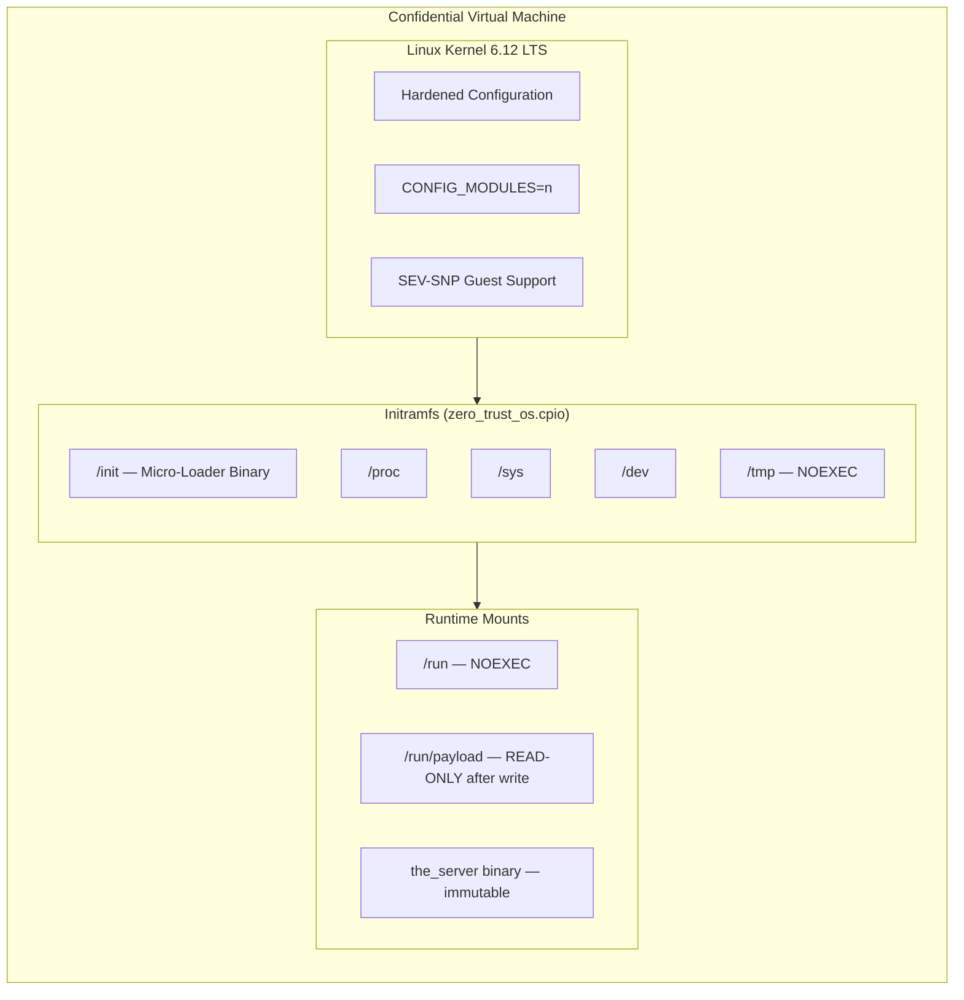

# Architecture

The Confidential Micro-Loader is a specialized `init` system (PID 1) designed to bootstrap a secure server inside an AMD SEV-SNP confidential virtual machine. There is **no traditional Linux distribution** underneath — no systemd, no bash, no SSH, no package managers. The entire system consists of two components: a hardened Linux kernel and a single static Rust binary.

## System Components



## Cryptographic Stack

All cryptographic operations use **aws-lc-rs** compiled in **FIPS mode**, backed by AWS-LC (a fork of BoringSSL with a FIPS 140-3 validated module):

| Operation | Algorithm | Library |
|:---|:---|:---|
| Signature Verification | ECDSA P-384 with SHA-384 | aws-lc-rs (FIPS) |
| Payload Hashing | SHA-384 | aws-lc-rs (FIPS) |
| Attestation Report Data | SHA-512 | aws-lc-rs (FIPS) |
| TLS Transport | TLS 1.3 with AES-256-GCM | rustls + aws-lc-rs |
| Key Exchange | X25519MLKEM768 (post-quantum hybrid) | aws-lc-rs |

## Boot Process (Step by Step)

### Step 1: Hardware Measurement

Before the kernel even starts, the **AMD Secure Processor** (a dedicated ARM core embedded in every AMD EPYC CPU) measures the entire boot image:
- The OVMF firmware (UEFI bootloader)
- The Linux kernel (`bzImage`)
- The initramfs (`zero_trust_os.cpio`)

This measurement is stored in a tamper-proof hardware register. Any modification to any of these components — even a single byte — will produce a completely different measurement. This measurement cannot be faked or overridden by any software, including the hypervisor.

### Step 2: Bare-Metal Bootstrapping

The kernel starts the micro-loader as PID 1 directly from the initramfs. The loader:
- Mounts essential filesystems (`/proc`, `/sys`, `/dev`)
- Mounts `/tmp` with `NOEXEC` flag (nothing written there can be executed)
- Mounts `/run` with `NOEXEC` flag
- Creates `/run/payload` as a dedicated tmpfs for the server binary
- Configures network interfaces and hardcoded DNS (Quad9 `9.9.9.9` + Cloudflare `1.1.1.1`)

> **Critical:** DHCP-provided DNS is deliberately ignored. The cloud provider cannot redirect DNS queries to a malicious resolver.

### Step 3: Secure Payload Fetching

The loader downloads three files from **hardcoded URLs** pointing to a public GitHub release:

```
https://github.com/deadrouter-ai/the-server/releases/latest/download/the_server
https://github.com/deadrouter-ai/the-server/releases/latest/download/the_server_hash.txt
https://github.com/deadrouter-ai/the-server/releases/latest/download/the_server.sig
```

TLS is configured with **maximum security hardening**:
- **TLS 1.3 only** — no protocol downgrade is possible
- **AES-256-GCM only** — no weaker cipher suites
- **X25519MLKEM768 key exchange only** — post-quantum hybrid, resistant to both classical and quantum computer attacks
- **Embedded Mozilla CA root certificate store** — the loader does not use `/etc/ssl/certs` from the host

This makes TLS man-in-the-middle attacks impossible without breaking the TLS connection entirely.

### Step 4: SHA-384 Hash Verification

Before any code executes, the loader performs an integrity check:

1. Downloads `the_server_hash.txt` from the release (the expected SHA-384 hash)
2. Computes the SHA-384 hash of the downloaded binary locally
3. Compares them in constant-time

```
If hashes DO NOT MATCH → PANIC SHUTDOWN. Immediate power-off.
If hashes MATCH         → Proceed to signature verification.
```

This catches corrupted downloads, CDN tampering, and partial file transfers before the more expensive signature verification step.

### Step 5: ECDSA P-384 Signature Verification

The downloaded binary is verified against a **hardcoded ECDSA P-384 public key** using the FIPS-validated aws-lc-rs library:

```
If signature is INVALID → PANIC SHUTDOWN. Immediate power-off. No code executes. Ever.
If signature is VALID   → Binary is accepted for execution.
```

The public key is a 97-byte uncompressed point on the NIST P-384 curve, compiled directly into the measured binary. This ensures that even if the download URL were somehow redirected (which is impossible because it's hardcoded), the attacker would need the owner's private signing key to produce a valid signature.

### Step 6: Filesystem Lockdown

After writing the verified binary to `/run/payload/the_server`:

1. `/run/payload` is **remounted as READ-ONLY** — the binary becomes immutable
2. `/tmp` is mounted with **NOEXEC** — nothing written there can execute
3. `/run` is mounted with **NOEXEC** — same

**After lockdown, no writable+executable filesystem exists anywhere in the VM.** Even if the server process is exploited via a zero-day, the attacker cannot:
- Modify the running binary (read-only)
- Drop and execute a payload anywhere (all writable locations are noexec)
- Load a kernel module (modules disabled at compile time)
- Open a shell (no shell binary exists)

### Step 7: Process Isolation

The server is spawned as a **child process** (not via `execve`). PID 1 (the loader) remains running and serves two critical roles:

1. **Independent attestation endpoint** on port 8080 — this is part of the measured code and cannot be tampered with. It exposes the SHA-384 hash of the running server binary, allowing anyone to verify what code is executing.
2. **Zombie process reaper** — required because PID 1 must `wait()` on orphaned children in Linux
3. **System watchdog** — if the server process dies, or if the attestation server fails, PID 1 triggers an **immediate panic shutdown** (power-off). The system cannot operate in a degraded state.

### Step 8: Hardware Attestation

The loader serves a REST API on port 8080 that allows anyone to request a hardware-signed attestation report:

```
GET /v1/attestation?nonce=<hex-encoded nonce>
```

The response includes:
- A user-provided **nonce** (1 to 128 bytes, hex-encoded to prevent replay attacks)
- The **SHA-384 hash** of the running server binary
- A **hardware-signed attestation report** from the AMD Secure Processor

The attestation report is signed by a key chain rooted in AMD's hardware. It proves:
- The VM is running on genuine AMD SEV-SNP hardware
- The boot measurement matches the expected value
- The signed `report_data` contains the 64-byte SHA-512 hash of the payload hash concatenated with the nonce bytes: `SHA-512(payload_sha384_bytes || nonce_bytes)`

This report is **cryptographically unforgeable**. No software — including the hypervisor, the cloud provider's management plane, or even a compromised kernel — can produce a valid attestation report with a different measurement.
