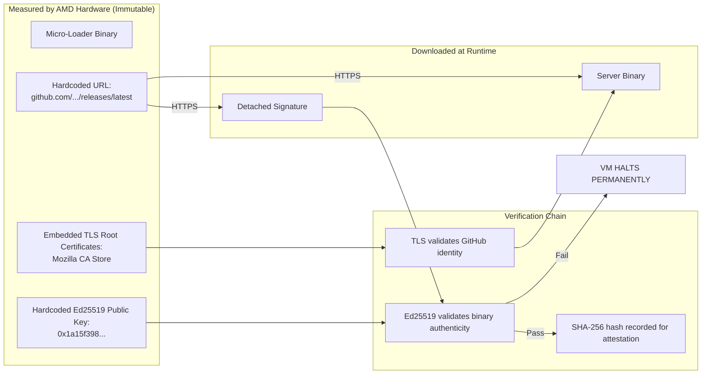
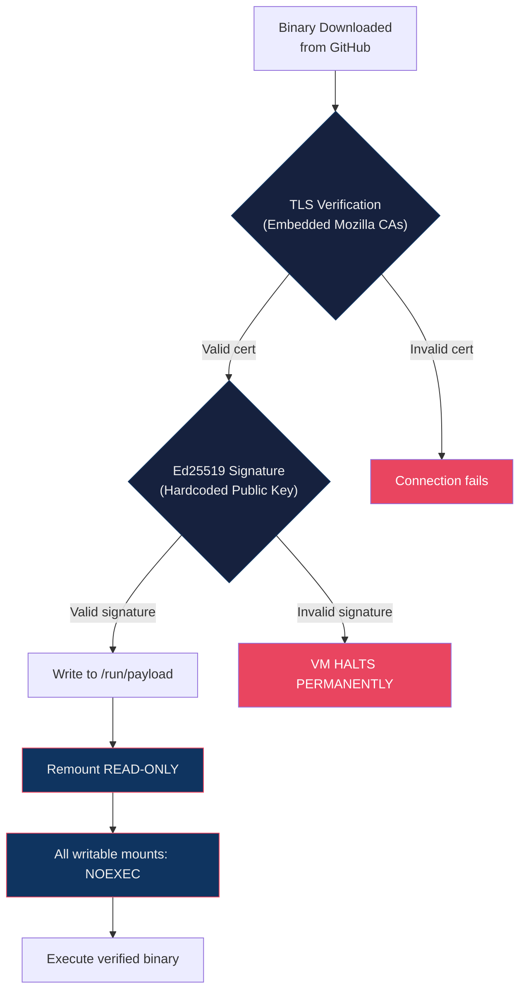

# Loader Security Audit: Why Runtime Fetching Is Safe

## Overview

The Confidential Micro-Loader uses an unusual architecture: instead of packaging the server application directly into the measured boot image, it **downloads** the server at runtime from a public GitHub release. This document provides a detailed security audit of this design choice, explaining why it does not introduce vulnerabilities and how multiple independent layers prevent abuse.

---

## The Architecture



---

## Security Analysis

### Question 1: Can the owner point the loader to a malicious server?

**No.** The download URLs are **hardcoded in the source code** and compiled into the binary:

```rust
const BINARY_URL: &str = "https://github.com/deadrouter-ai/api-proxy-server/releases/latest/download/server";
const SIGNATURE_URL: &str = "https://github.com/deadrouter-ai/api-proxy-server/releases/latest/download/server.sig";
```

These URLs are part of the **measured binary**. Changing them would:
1. Change the compiled binary → change the CPIO hash → change the SEV-SNP measurement
2. Be visible in the public source code diff to anyone watching the repository
3. Require a new release that users would need to re-verify

**Verdict: ✅ Not a vulnerability.** The URLs cannot be changed without detection.

---

### Question 2: Can the owner push a backdoored server update?

**Technically possible, but immediately detectable.** Here's why this attack fails in practice:

1. **The server source code is fully public.** The binary is built from `github.com/deadrouter-ai/api-proxy-server`, which is a public repository. Every line of code is visible. Every commit is traceable.

2. **The build pipeline is public GitHub Actions.** There are no secret build steps. Anyone can fork the repo, run the same pipeline, and verify they get the same binary.

3. **The attack cannot be targeted.** A backdoored release would be served to **all users equally**. The owner cannot serve different binaries to different users because GitHub Releases are a public CDN. This makes targeted attacks impossible and mass attacks immediately visible.

4. **Users can compile and compare.** Anyone suspicious can compile the server from source, compute its SHA-256 hash, and compare it against the hash reported by the attestation endpoint. If they differ, the backdoor is exposed.

5. **The signing key provides accountability.** Only the owner can sign a release. A backdoored release is cryptographically traceable to the owner's signing key. This is a strong deterrent.

**Verdict: ✅ Mitigated by transparency.** The owner can sign a malicious release, but it would be:
- Built from public source code (auditable)
- Built by a public CI pipeline (reproducible)
- Served to everyone equally (not targetable)
- Cryptographically traceable to the owner (accountable)

---

### Question 3: Can GitHub serve a malicious binary?

**No.** Even if GitHub (or a state-level attacker that has compromised GitHub) replaces the binary on the release page, the attack fails:

1. **Ed25519 signature verification is independent of TLS.** The binary must carry a valid signature matching the hardcoded public key. GitHub does not have access to the owner's private Ed25519 signing key.

2. **The public key is hardcoded in the measured binary.** It cannot be swapped out without changing the SEV-SNP measurement:
   ```rust
   const PUBLIC_KEY_BYTES: [u8; 32] = [
       0x1a, 0x15, 0xf3, 0x98, 0x31, 0xd2, 0x7f, 0x93,
       // ... (hardcoded, immutable, measured by hardware)
   ];
   ```

3. **On signature failure, the VM halts permanently.** There is no fallback, no retry with different code, no degraded mode. The system enters an infinite sleep loop. No code ever executes.

**Verdict: ✅ Not a vulnerability.** GitHub cannot forge the owner's signature.

---

### Question 4: Can a state-level attacker compromise the TLS/CA system?

**A compromised CA allows intercepting the download, but not bypassing signature verification.**

Attack scenario: A state actor compels a Certificate Authority to issue a fraudulent certificate for `github.com`, allowing them to MITM the HTTPS connection and serve a different binary.

Defense: The Ed25519 signature is a **completely independent verification layer** that does not depend on TLS or the CA system. Even if the TLS layer is fully compromised:
- The attacker can serve a different binary ✅
- The attacker **cannot** produce a valid Ed25519 signature ❌
- The VM halts on the invalid signature ✅

**Verdict: ✅ Defense in depth works.** TLS is the first layer; Ed25519 is the second, independent layer.

---

### Question 5: What about the runtime filesystem after download?

After the binary is verified and written to disk, the loader performs a complete filesystem lockdown:

| Mount Point | Permission | Purpose |
|:---|:---|:---|
| `/run/payload` | READ-ONLY | Server binary lives here — immutable after write |
| `/tmp` | NOEXEC | Writable scratch space — but nothing can execute from here |
| `/run` | NOEXEC | Runtime directory — no executables allowed |
| `/proc`, `/sys` | NOEXEC | Kernel interfaces — standard security flags |

**After lockdown, no writable+executable filesystem exists.** This means even if the server process has a remote code execution vulnerability, the attacker:
- Cannot modify the server binary (read-only)
- Cannot drop and run a new binary (all writable dirs are noexec)
- Cannot load a kernel module (`CONFIG_MODULES=n`)
- Cannot open a shell (no shell binary exists anywhere in the filesystem)
- Cannot persist across reboot (everything is RAM-only, no disk)

---

### Question 6: Why not just include the server in the boot image?

Including the server in the boot image would mean:
- **Every server update changes the SEV-SNP measurement.** Users would need to re-verify after every update, which creates friction and reduces security (users stop checking).
- **The boot image becomes large and hard to audit.** The server may be millions of lines of code. The loader is ~750 lines.
- **No separation of concerns.** The measured trust anchor should be small, stable, and auditable. The application logic should be independently updatable.

With the current architecture:
- The loader (trust anchor) is tiny, stable, and rarely changes
- The server can be updated without changing the measurement
- Updates still require the owner's cryptographic signature
- The small loader is easy for anyone to audit completely

---

## Summary of Defense Layers



| Layer | What It Stops | Independent? |
|:---|:---|:---|
| **TLS with embedded CAs** | Network interception, DNS hijacking | Yes |
| **Ed25519 signature** | Tampered binaries, compromised GitHub, rogue CAs | Yes |
| **Hardcoded URLs** | Redirection to malicious servers | Yes |
| **Public source code** | Hidden backdoors by the owner | Yes |
| **Reproducible builds** | Discrepancies between source and binary | Yes |
| **Filesystem lockdown** | Post-exploitation persistence | Yes |
| **AMD SEV-SNP measurement** | Boot image tampering by the cloud provider | Yes |

Each layer is **independently sufficient** to stop its targeted attack class. An attacker must defeat **all layers simultaneously** to compromise the system.
