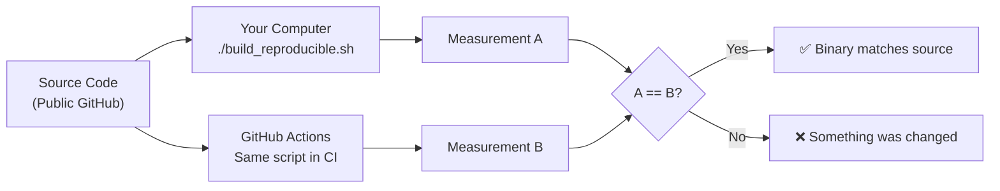

# Reproducible Builds

## Why Reproducible Builds Matter

A "reproducible build" means that **anyone** can compile the source code and get the **exact same binary**, byte for byte. This is critical for trust:

- If you can compile the source code and get the same binary that's running in production, you **know** the production binary was built from that source code
- If the hashes don't match, something was changed between the source code and the binary — a potential backdoor

Without reproducible builds, you'd have to trust the developer's word that the binary matches the source. With reproducible builds, you verify it mathematically.

## How It Works

The build process runs inside a Docker container with **pinned, exact versions** of every tool:

| Component | Version | How It's Pinned |
|:---|:---|:---|
| Base OS | Ubuntu 24.04 | Docker image locked by SHA-256 digest |
| C Compiler | GCC 11.4.0 | From Ubuntu 24.04 `build-essential` package |
| Rust Compiler | 1.95.0 | Installed with `rustup --default-toolchain 1.95.0` |
| musl libc | From Ubuntu 24.04 | `musl-tools` package |
| Kernel Source | 6.12.91 | Downloaded from `cdn.kernel.org` |
| OVMF Firmware | 20250523-2.el10 | Downloaded from Rocky Linux, hash-verified |
| Rust Dependencies | Locked | `Cargo.lock` ensures exact crate versions |
| FIPS Crypto Module | aws-lc-rs 1.17 | Compiled from source with FIPS flag (requires Go + CMake) |

## FIPS Build Requirements

The loader uses `aws-lc-rs` with the `fips` feature enabled, which compiles the AWS-LC FIPS module from source inside the container. This requires additional build dependencies beyond a standard Rust project:

- **Go compiler** — required by the AWS-LC FIPS build system (BoringSSL heritage)
- **CMake** — drives the C/ASM compilation of the cryptographic module
- **libclang / clang** — used by `bindgen` to generate Rust FFI bindings from C headers

These are all installed automatically inside the Docker container and do not need to be present on the host system.

## Sources of Non-Reproducibility (And How We Eliminate Them)

Building the same source code with different tools can produce different binaries. Here's what we control:

### 1. Compiler Versions
**Problem:** GCC 14 produces different machine code than GCC 11 for the same C source.  
**Solution:** The Docker container uses Ubuntu 24.04's `build-essential` which provides GCC 11.4.0. The Dockerfile is pinned by SHA-256 digest, ensuring the exact same package versions.

### 2. Rust Toolchain
**Problem:** Different Rust compiler versions produce different binaries.  
**Solution:** Rust 1.95.0 is installed inside the Docker image. The build script does **not** mount the host's `$HOME/.cargo` into the container, preventing the host's Rust installation from overriding the container's.

### 3. Build Path Embedding
**Problem:** Rust embeds absolute file paths (e.g., `/home/user/projects/...`) in debug info and panic messages.  
**Solution:** `RUSTFLAGS="--remap-path-prefix $(pwd)=/workspace"` maps all paths to a canonical `/workspace` prefix.

### 4. Timestamps
**Problem:** File timestamps in the CPIO archive differ between machines.  
**Solution:** All file timestamps in the rootfs are set to epoch zero (`touch -h -d @0`), and `cpio --reproducible` is used.

### 5. File Ordering
**Problem:** `find` may return files in different orders on different filesystems.  
**Solution:** Files are piped through `LC_ALL=C sort` before `cpio` to ensure deterministic ordering.

### 6. Kernel Build Variables
**Problem:** The kernel embeds build timestamps, usernames, and hostnames.  
**Solution:** These are all overridden with fixed values:
```bash
export KBUILD_BUILD_TIMESTAMP="1970-01-01 00:00:00"
export KBUILD_BUILD_USER="builder"
export KBUILD_BUILD_HOST="buildhost"
export KBUILD_BUILD_VERSION="1"
export SOURCE_DATE_EPOCH=0
```

### 7. Cargo Target Directory
**Problem:** If the host has a `target/` directory with cached artifacts from a different build environment, those can leak into the Docker build.  
**Solution:** The container sets `CARGO_TARGET_DIR=/tmp/cargo-target` to use an isolated directory that doesn't exist on the host.

### 8. Kernel Compilation Cache (ccache)
**Problem:** ccache speeds up compilation but could affect output.  
**Solution:** ccache only caches preprocessor output. It does **not** affect the final compiled binary — it's an optimization-only tool. The same source + compiler always produces the same object code regardless of cache state.

### 9. FIPS Module Compilation
**Problem:** The aws-lc-rs FIPS module includes a C/ASM build step driven by CMake and Go, which could introduce non-determinism.  
**Solution:** The Go compiler and CMake versions are pinned inside the Docker container. The FIPS module source is locked via `Cargo.lock`, ensuring the exact same C source is compiled every time.

## Verification Process



### Quick Verification

```bash
# Clone and checkout the exact release tag
git clone https://github.com/deadrouter-ai/sev-micro-loader.git
cd sev-micro-loader
git checkout v1.0.0  # Use the actual release tag

# Run the reproducible build
./build_reproducible.sh

# The script prints the Final SEV-SNP Measurement
# Compare it against the value on the GitHub Release page
```

If the measurements match, you have mathematical proof that the release binary was compiled from the published source code with no modifications.
