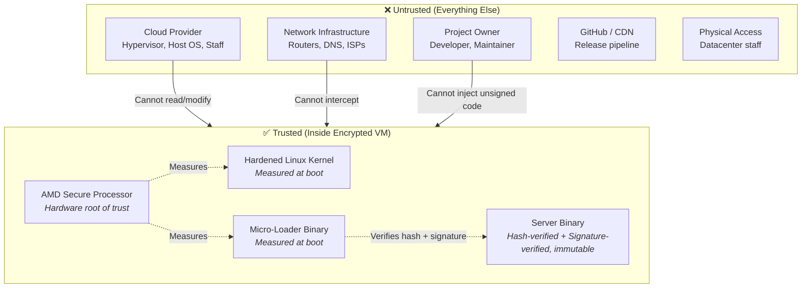

# Threat Model

The Confidential Micro-Loader operates under a strict **zero-trust** threat model designed for AMD SEV-SNP Confidential Computing. We assume **every entity** outside the encrypted VM is potentially malicious — including the cloud provider, the network, and even the project owner.

## Trust Boundary

## Threat Catalog

### 1. Malicious Cloud Provider

The cloud provider controls the physical hardware, the hypervisor, and the network. They are the most powerful adversary.

| Attack Vector | Description | Mitigation | Status |
|:---|:---|:---|:---|
| **Read VM memory** | Provider dumps RAM to inspect secrets | AMD SEV-SNP encrypts all VM memory with a per-VM key derived by hardware. The provider never has access to this key. Even a physical RAM dump yields only ciphertext. | ✅ Mitigated |
| **Modify boot image** | Provider replaces kernel or initramfs with a backdoored version | AMD Secure Processor measures the boot image before execution. Any modification changes the measurement. Users compare the measurement against their locally-compiled value to detect tampering. | ✅ Mitigated |
| **Inject code via DMA** | Provider uses hardware DMA to write to VM memory | SEV-SNP enforces Reverse Map Table (RMP) checks. DMA from the host to guest-encrypted pages is blocked by hardware. | ✅ Mitigated |
| **Replay old VM state** | Provider restores a previous VM snapshot to revert security patches | SEV-SNP includes a version counter in attestation reports. Replayed VMs have stale counters detectable by auditors. | ✅ Mitigated |
| **Manipulate DHCP/DNS** | Provider returns malicious DNS entries to redirect traffic | DNS resolvers are **hardcoded** (Quad9 `9.9.9.9`, Cloudflare `1.1.1.1`). DHCP-provided DNS is explicitly ignored. The loader writes its own `/etc/resolv.conf` before any network request. | ✅ Mitigated |
| **TLS man-in-the-middle** | Provider intercepts HTTPS using a rogue CA certificate | The loader enforces **TLS 1.3 only** with **AES-256-GCM** and **X25519MLKEM768** (post-quantum hybrid key exchange). It uses an embedded Mozilla CA root store compiled into the binary. Protocol downgrade is impossible. Rogue CAs cannot be injected because the cert store is part of the measured binary. | ✅ Mitigated |
| **Intercept serial console** | Provider reads VM console output for secrets | The loader only prints operational status messages. No secrets, keys, or sensitive data are ever printed to the console. | ✅ Mitigated |

### 2. Network Adversary

Any entity that can observe or manipulate traffic between the VM and the internet.

| Attack Vector | Description | Mitigation | Status |
|:---|:---|:---|:---|
| **DNS spoofing** | Redirect `github.com` to attacker-controlled server | Hardcoded DNS resolvers (Quad9 + Cloudflare) via trusted public infrastructure. DHCP DNS ignored. | ✅ Mitigated |
| **TLS interception** | Present a fraudulent TLS certificate for github.com | Embedded Mozilla CA root store. Provider cannot add rogue CAs. Connection fails if cert doesn't chain to a real CA. | ✅ Mitigated |
| **Binary substitution** | Replace the downloaded server binary in transit | Even if an attacker somehow broke TLS, two independent checks protect the binary: (1) **SHA-384 hash verification** against the published hash file, and (2) **ECDSA P-384 signature verification** against the hardcoded public key. Both must pass or the VM shuts down immediately. | ✅ Mitigated |
| **Network blackholing** | Block all network traffic to prevent booting | The loader retries downloads with configurable backoff (5 attempts, 3s delay). Persistent network failure triggers **immediate shutdown** (power-off). This is a denial-of-service but not a confidentiality/integrity breach. | ⚠️ DoS only |

### 3. Malicious Project Owner

The person who controls the signing key and the source code repository. This is the most subtle threat.

| Attack Vector | Description | Mitigation | Status |
|:---|:---|:---|:---|
| **Push backdoored server** | Owner publishes a malicious update to the server repo | The server repository is **fully public and open source**. Every commit is visible. The build pipeline runs on **public GitHub Actions** with no secret build steps. The community can audit every change before trusting it. | ✅ Mitigated by transparency |
| **Push backdoored loader** | Owner modifies the micro-loader to bypass protections | The loader is **measured by AMD hardware**. Any change to the loader changes the SEV-SNP measurement. Users who previously verified the measurement will immediately detect the change. The loader source is also public and auditable. | ✅ Mitigated by measurement |
| **Sign malicious binary** | Owner signs a backdoored release with their ECDSA P-384 private key | The source code is public. Users can compare the released binary against what they compile from the public source. If the binary doesn't match the source, the backdoor is exposed. Additionally, the owner cannot selectively target users — a malicious release affects everyone equally and is publicly visible. | ✅ Mitigated by reproducible builds |
| **Change hardcoded URLs** | Owner points the loader to a private server | Changing any hardcoded value changes the binary, which changes the CPIO, which changes the SEV-SNP measurement. Users would detect this immediately. | ✅ Mitigated by measurement |

### 4. Compromised GitHub / State-Level Attack

A nation-state or advanced adversary that has compromised GitHub's infrastructure.

| Attack Vector | Description | Mitigation | Status |
|:---|:---|:---|:---|
| **Serve modified release binary** | GitHub serves a different binary than what was built | The binary must pass both **SHA-384 hash verification** and **ECDSA P-384 signature verification**. The signing key is held exclusively by the owner, not by GitHub. GitHub cannot produce a valid signature. The VM powers off on any verification failure. | ✅ Mitigated |
| **Modify source code on GitHub** | Alter the visible source code to hide a backdoor | Users verify via **reproducible builds**. They compile the source locally and compare the measurement against the live attestation. If GitHub modified the source, the locally-compiled measurement won't match the attestation, exposing the tampering. | ✅ Mitigated |
| **Compromise the CA system** | Issue a fraudulent TLS certificate for github.com | Even if TLS is broken, the **SHA-384 hash check** and **ECDSA P-384 signature verification** are completely independent layers. A rogue TLS cert allows downloading a binary, but not faking the hash or signature. | ✅ Mitigated |
| **Backdoor the Rust compiler** | Supply-chain attack via compromised `rustc` | The Docker build environment uses a **pinned** Ubuntu base image (locked by SHA-256 digest), a specific Rust version (1.95.0), and specific GCC version (11.4.0). Users can verify the toolchain integrity independently. The build is deterministic — any toolchain modification produces different hashes. | ⚠️ Partially mitigated |

### 5. Runtime Exploitation

An attacker who finds a vulnerability in the running server application.

| Attack Vector | Description | Mitigation | Status |
|:---|:---|:---|:---|
| **Remote code execution** | Attacker gains code execution in the server process | Even with full RCE, the attacker **cannot**: (1) modify the binary (READ-ONLY mount), (2) write+execute a payload anywhere (all writable mounts are NOEXEC), (3) load a kernel module (CONFIG_MODULES=n), (4) open a shell (no shell binary exists). | ✅ Mitigated |
| **Privilege escalation** | Attacker escalates from server process to root | Even as root, the filesystem lockdown is enforced by the kernel's mount system. The binary mount is read-only. Writable mounts have NOEXEC. There is no `insmod`, no `/bin/sh`, no package manager to install tools. | ✅ Mitigated |
| **SSH backdoor** | Attacker opens a reverse shell | There is **no SSH daemon, no shell binary, no scripting interpreter**. The only processes are the micro-loader (PID 1) and the server. The attack surface is limited to the server's network protocol and the attestation endpoint. | ✅ Mitigated |
| **Persistent compromise** | Attacker persists across reboots | The entire filesystem is **RAM-only** (tmpfs/initramfs). There is no disk. A reboot starts fresh from the measured boot image. | ✅ Mitigated |

### 6. Physical Access

Datacenter staff or anyone with physical access to the server hardware.

| Attack Vector | Description | Mitigation | Status |
|:---|:---|:---|:---|
| **Cold boot attack** | Freeze RAM and extract keys | SEV-SNP uses **AES-128 hardware encryption** for all guest memory. Physical RAM access yields only ciphertext. | ✅ Mitigated |
| **DMA attack** | Use PCIe/DMA devices to read guest memory | SEV-SNP Reverse Map Table (RMP) enforces that host DMA cannot access guest-encrypted pages. | ✅ Mitigated |
| **Replace hardware** | Swap the CPU with a compromised one | SEV-SNP attestation includes the platform identity. A different CPU produces a different attestation chain that fails verification against AMD's public VCEK certificates. | ✅ Mitigated |

## What Is NOT Protected

| Limitation | Description |
|:---|:---|
| **Denial of service** | The cloud provider can shut down, throttle, or network-isolate the VM. SEV-SNP protects confidentiality and integrity, not availability. |
| **Side-channel attacks** | Some CPU side-channel attacks (e.g., spectre variants) may leak information across VM boundaries. AMD has mitigations but this is an evolving research area. |
| **AMD hardware backdoor** | If AMD's silicon contains an undisclosed backdoor, the entire trust model fails. This is the fundamental trust assumption of the architecture. |
| **Bugs in this code** | Software bugs in the loader or kernel could theoretically be exploited. The loader is small (~950 lines) to minimize this risk, and the kernel is compiled with KSPP hardening options. |
